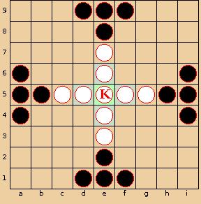

Tablut
=============
###### Data Structures (CS61B-Fa19) taught by Prof. Hilfinger at UC Berkeley 
### CS61B project 3

--------------------------

# Introduction
The puzzle game Signpost is one of Simon Tatham's collection of GUI games (available on a variety of operating-system configurations, including Ubuntu.) He attributes the puzzle to Angela and Otto Janko, who call it Pfeilpfad (arrow path). In this mini-project, you are given an incomplete Java program that creates these puzzles and allows its user to solve them, and you must supply the missing parts to complete the implementation.

The puzzle itself is quite simple. It is played on a W×H rectangular grid of square cells. All but one of the squares is annotated with an arrow pointing horizontally, vertically, or diagonally. The remaining square—the goal—is annotated with a star. Some squares contain distinct numbers between 1 and W⋅H. The first and last squares in sequence (those numbered 1 and W⋅H) are always numbered. The puzzle may be set to have free ends, in which case the first and last squares may appear anywhere on the board. By default, there are no free ends and the first and last squares are in the upper-left and lower-right corners, respectively. The idea is to connect the squares into a sequence from square 1 to W⋅H. Each square is connected to another that is in the direction of its arrow such that all the squares are connected. If a square initially has a number, it must be the number of that square in the sequence of connected squares.

The diagrams below show a sample puzzle on the left and its solution on the right. The bottom-left corner of the board has the coordinates (0,0), with the positive x-axis running horizontally to the right, and the positive y-axis running vertically upwards.

To connect two squares, press and hold on the first in sequence and drag to the second. To disconnect them, press and hold on the first, drag to a position off the grid, and release.

Project 2: Tablut
"Tafl emk ǫrr at efla...." Jarl Rognvald Kali Kolsson
[Revisions to the project spec since its release are underlined.]

Introduction
Tablut is one of the family of tafl (or hnefatafl) games: Nordic and Celtic strategy games played on checkered boards between two asymmetric armies. These are ancient games, possibly related to the Roman game ludus latrunculorum, that were generally displaced by chess in the 12th century. Tablut is a variant from Lapland (the northernmost region of Finland). The detailed rules of these games are generally disputed; tablut, having survived into the 1700s, is perhaps best documented (by none other than Carl Linnaeus, the fellow responsible for our state animal being known as Ursus arctos californicus and our state trees as Sequoia sempervirens and Sequoiadendron giganteum in scientific circles). However, his account is itself incomplete and additional confusion resulted from the later mistranslation of his manuscript from Latin. Therefore, any of you familiar with modern reconstructions of the game should not expect that our version will be identical to yours.

Tablut is played on a 9x9 checkerboard between a set of 9 white pieces and 16 black pieces. The middle square is called the throne (or castle). One of the white pieces is the king, and the others, his guards, are known as Swedes. The white side wins if the king reaches one of the edges of the board. The black pieces are known as Muscovites (referring to the Grand Duchy of Moscow). Their aim is to capture the king before he reaches the edge of the board.
Game of Tablut Initial Game of Tablut Move
Figure 1. On the left: a Tablut board showing the standard numbering of squares, and the initial placement of the pieces. On the right: the board that results after the three moves i6-g, d5-7, i4-g (the last move is a capture).

All pieces move like chess rooks: any number of squares orthogonally (horizontally or vertically). Pieces may not jump over each other or land on top of another piece. No piece other than the king may land on the throne, although any piece may pass through it when it is empty. The black (Muscovite) side goes first.

A piece other than the king is captured when, as a result of an enemy move to an orthogonally adjacent square, the piece is enclosed on two opposite sides (again orthogonally) by hostile squares. A square is hostile if it contains an enemy piece, or if it is the throne square and is empty (that is, it is hostile to both white and black pieces). The occupied throne is also hostile to white pieces when three of the four squares surrounding it are occupied by black pieces. Captures result only as a result of enemy moves; a piece may move so as to land between two enemy pieces without being captured. A single move can capture up to three pieces.

The king is captured like other pieces except when he is on the throne square or on one of the four squares orthogonally adjacent to the throne. In that case, the king is captured only when surrounded on all four sides by hostile squares (of which the empty throne may be one).

A side also loses when it has no legal moves on its turn, or if its move returns the board to a previous position (same pieces in the same places and the same side to move). As a result, there are no drawn games.

Notation
A square is denoted by a column letter followed by a row number (as in e4). Columns are enumerated from left to right with letters a through i. Rows are enumerated from the bottom to the top with numbers 1 through 9. An entire move then consists of the starting square, a hyphen, and the ending row (if vertical) or column (if horizontal). Thus, b3-6 means "Move from b3 to b6" and b3-f means "Move from b3 to f3."

Commands
When running from the command line, the program will accept the following commands, which may be preceded by whitespace.

new: End any game in progress, clear the board to its initial position, and set the current player to black.
A move in the format described in Notation.
seed N: If the AIs are using random numbers for move selection, this command seeds their random-number generator with the integer N. Given the same seed and the same opposing moves, an AI should always make the same moves. This feature makes games reproducible.
auto C: Make the C player an automated player. Here, C is "black" or "white", case-insensitive.
manual C: Make the C player a human player (entering moves as manual commands).
limit N: Make N be the maximum number of moves that a player may make during the current game. A player loses if the game has not ended by the time he must make his (N+1)st move. The command is in error if either player has already made at least N moves. The move limit is removed by a new command. (A move limit is not a normal provision of Tablut; we've added it for testing convenience so that we can test whether a program can find a forced win within a given number of moves.)
dump: Print the current state of the board in exactly the following format:

===
  - - - B B B - - -
  - - - - B - - - -
  - - - - W - - - -
  B - - - W - - - B
  B B W W K W W B B
  B - - - W - - - B
  - - - - W - - - -
  - - - - B - - - -
  - - - B B B - - -
===
Here, K denotes the king, W another white piece (Swede) and B a black piece (Muscovite). You must not use the === lines for any other output).

quit: Exit the program.
Feel free any other commands you think might be nice.

Output
When an AI plays, it should print out each move that it makes using exactly the format

 * a1-4
(with asterisk shown). Do not print these lines out for a manual player's moves.

When one side wins, the program should print out one of

 * White wins.
 * Black wins.
(also with periods) as appropriate. Do not use the * character in any other output you produce.

You may prompt a manual player for input using the form

...>
where "..." may be any text. The grading scripts will discard any text from the beginning of a line up to a > character.

Your Task
Your job is to write a program to play Tablut. To run it in text mode, use the command

java -ea tablut.Main
to enter commands from the terminal or use

java -ea tablut.Main INPUT
to feed it commands from file INPUT.

The AI in your program should be capable of finding a win that is within 4 moves. Experiment a bit to see what works. The autograder will allow 3 minutes for a fully automated game.

The GUI is an optional (extra credit) part of this project. We will actually do automatic testing only on the commands

java -ea tablut.Main
and

java -ea tablut.Main INPUT
